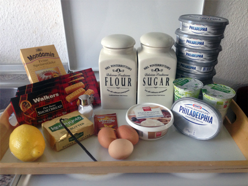
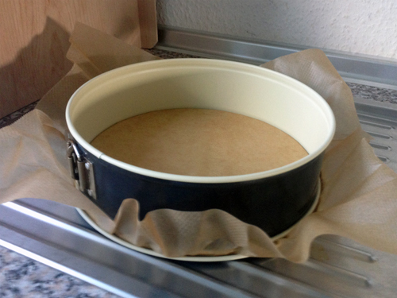
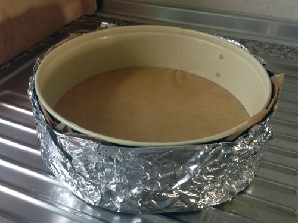
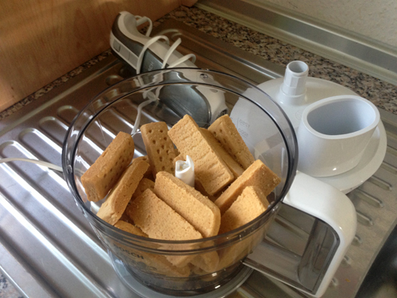
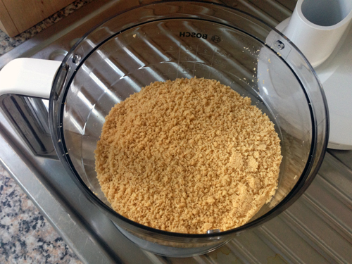
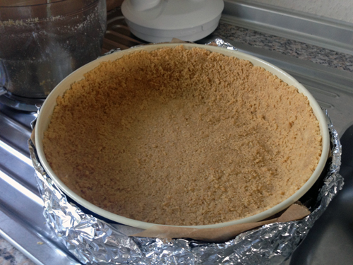
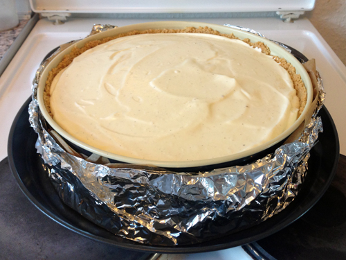
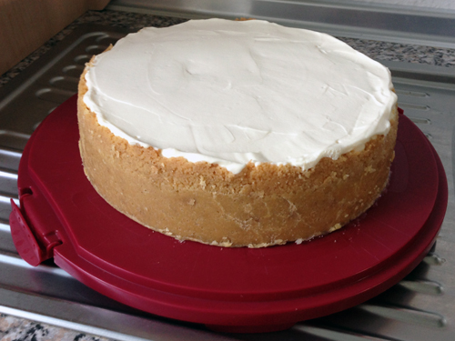
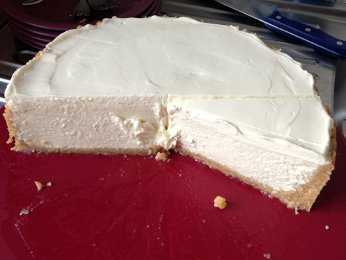

# New York Cheesecake

## Zutaten

Es ist wichtig, dass alle Zutaten Zimmertemperatur haben.  

#####Folgendes Zubehör wird benötigt:

* Aluminiumfolie
* Backpapier
* 26er Springbackform
* Ofenfester Behälter, in den die Springbackform passt
* Handmixer, Schneebesen

#### Zutaten Keksboden

* 450g Kekse *z.B. Walkers Pure Butter Shortbread*
* 150g Karamellgebäck *optional*
* 1 Prise Salz
* 1 Päckchen Vanillezucker
* 80g geschmolzene Butter
* 2 TL Zucker

#### Zutaten Käsemasse

* 8 Philadelphia Frischkäse
* 350g Zucker
* 60g Mehl
* 1 El Speisestärke
* 1 Päckchen Vanillezucker
* 0,5 Vanilleschote
* 2 Eier
* 200g Saure Sahne
* 1 TL Zitronensaft

#### Zutaten Topping

* 200g Mascarpone
* 200g Saure Sahne
* 0,5 TL Zitronensaft
* 1 Prise Salz
* 40g Zucker  

## Zubereitung

### Keksboden
######Zuerst die 26er Springform vorbereiten:

Backofen vorheizen auf Ober- Unterhitze 180 Grad.  
Backform fetten.  
Boden der Backform mit Backpapier auslegen.  
  
Backform bestmöglich mit Silberfolie abdichten.  
  

Butter schmelzen. Kekse zerbröseln. 

Salz, Vanillezucker und Zucker mit den zerbröselten Keksen vermischen und die geschmolzene Butter unterrühren.  
Die Keksmasse in der vorbereiteten Springform verteilen und andrücken.
  

10 Minuten Backen. Auskühlen lassen und für mindestens eine Stunde in den Kühlschrank stellen.

### Käsemasse

Backofen vorheizen auf Ober- Unterhitze 180 Grad.

Philadelphia Frischkäse mit dem Handmixer cremig rühren.  
Zucker, Mehl, Speisestärke und Vanillezucker zuerst vermischen und dann mit dem Frischkäse mixen. 
Nicht zu lange mixen, nur bis die Zutaten vermischt sind!.  
Mark der Vanilleschote auskratzen und zu der Käsemasse geben. 
Eier, Saure Sahne und Zitronensaft dazu geben.
Alles miteinander verrühren, nur so lange, bis alles vermischt ist. 
Käsemasse auf den vorbereiteten Keksboden geben und glatt streichen.
Mit Aluminiumfolie abdecken.
Springform in einen ofenfesten Behälter stellen und den ca. 1cm hoch mit Wasser befüllen.
In den vorgeheizten Ofen im unteren Drittel stellen und **40 Minuten Backen**. 

Nach 40 Minuten Backzeit die Aluminiumfolie runter nehmen, Ofen **auf 160 Grad** runter regulieren und **nochmals 20 Minuten** Backen. 

Kuchen aus dem Ofen nehmen und auskühlen lassen. 

### Topping
Mascarpone, Saure Sahne, Zitronensaft, Salz und Zucker miteinander vermischen, auf den ausgekühlten Kuchen geben und glatt streichen.
 

Kuchen am besten über Nacht in den Kühlschrank stellen.

